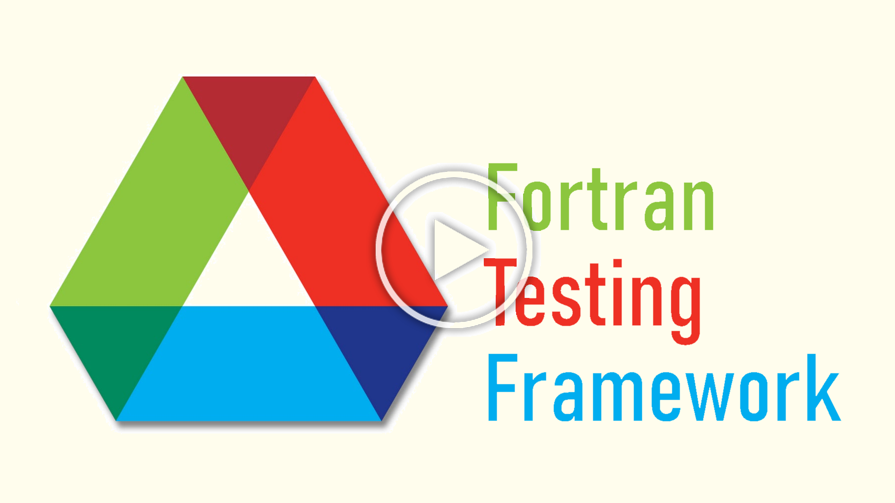

[Github Profile](https://github.com/agforero) | [LinkedIn](https://www.linkedin.com/in/afor/)

### Seminar at Argonne:

(Click to play!)

### About me:
Hey there! My name is Agustin, and I am a Computer Science and History double major at [St. Olaf College](https://wp.stolaf.edu/), class of 2021. Originally from the town of Naperville, Illinois, I am an avid software designer, working with several different languages and skills for the projects I involve myself in. So far, I have experience in the following languages:

* C/C++
* Python
* JavaScript
* React.js
* Bash
* GNU Make
* Fortran
* Intel/ARM Assembly
* HTML5/CSS

During the summer of 2020, I interned at [Argonne National Laboratory](https://www.anl.gov) as a Research Aide at the [Leadership Computing Facility](https://www.alcf.anl.gov/). I worked alongside two PhD's to build tools for researching bleeding-edge compilers and supercomputing technologies.

### Projects:
#### Projects created for Argonne:
* [Fortran Testing Framework](https://github.com/agforero/FTFramework): a collection of Python and Bash scripts to enable easy testing of Fortran compilers using [BATS](https://github.com/bats-core/bats-core).
* [nSTREAM](https://github.com/agforero/nSTREAM/): a fork of [STREAM](https://github.com/jeffhammond/STREAM) meant to benchmark and graph the memory bandwidth of a supercomputer. Utilizes OpenMP.

#### Independent Projects:
* [TMinesweeper](https://github.com/agforero/TMinesweeper/): a terminal-based Minesweeper game, coded in C++.
* [chain](https://github.com/agforero/chain): a heterogeneous, amendable data structure for C++. (WIP)
* [SI-PLANNING](https://github.com/agforero/SI-PLANNING/): a repo holding all my TA lesson plans from the spring of 2020.

### About me (but longer):
I know some people just want to get to the juicy bits, so I sought to concisely list them at the top. Here, though, I can write in greater detail about who I am and what I'm passionate about.

Ever since I was little, I've had two passions: computer science, and history. My love for software grew from experimenting on  our old, beat-up Windows XP tower. Sure, my mom didn't love it when I downloaded German viruses and explored `System32`, but what else was I supposed to do without that shady copy of *Polar Bowler*? 

I've also had a ceaseless interest in the world of history and political science. Games like Civilization III certainly helped propel that forward, where I spent half of my time reading the Civilopedia instead of actually playing the game. Now, it's games like Europa Universalis IV and Civilization IV that continue to bring my love of history to the screen.

I have a great appreciation for the creation of patterns, the efficiency of algorithms and the conciseness of operations. I have always held 4X games dear for their ability to elegantly envelop users in an intricate world of strategy based around real-life nations and figureheads. Whether it's in the field of history or not, I hope to one day create software that is widely applicable, easily understood, and readily adaptable.
